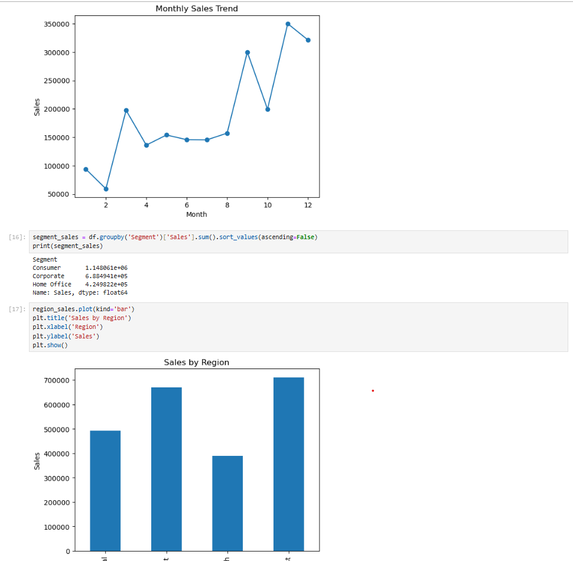
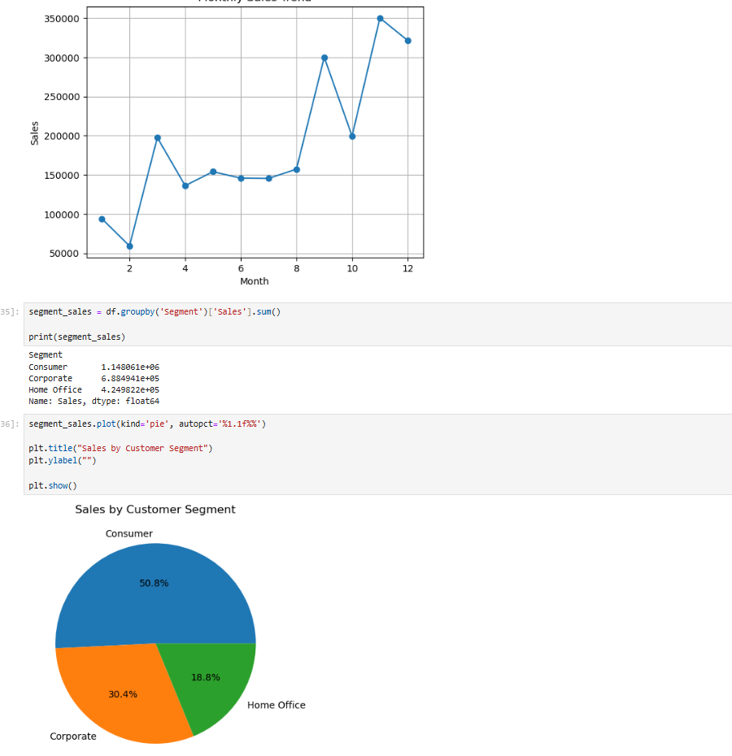

# Superstore Sales Analysis

## Project Overview
This project analyzes Superstore sales data using Python and Jupyter Notebook.

## Objectives
- Clean and preprocess sales data
- Perform Exploratory Data Analysis (EDA)
- Analyze sales trends
- Analyze customer segments
- Generate business insights

## Tools & Technologies
- Python
- Pandas
- NumPy
- Matplotlib
- Seaborn
- Jupyter Notebook

## Key Insights
- Total Sales: $2.26 Million
- Total Orders: 4,922
- Total Customers: 793
- Consumer segment contributes the highest sales
- Technology category generates the highest revenue
- West region records the highest sales

## Project Structure

data/
notebooks/
screenshots/

## Project Screenshots

### Monthly Sales Trend

### Customer Segment Analysis

### Power BI Dashboard

## Author
Bheemalingappa 
